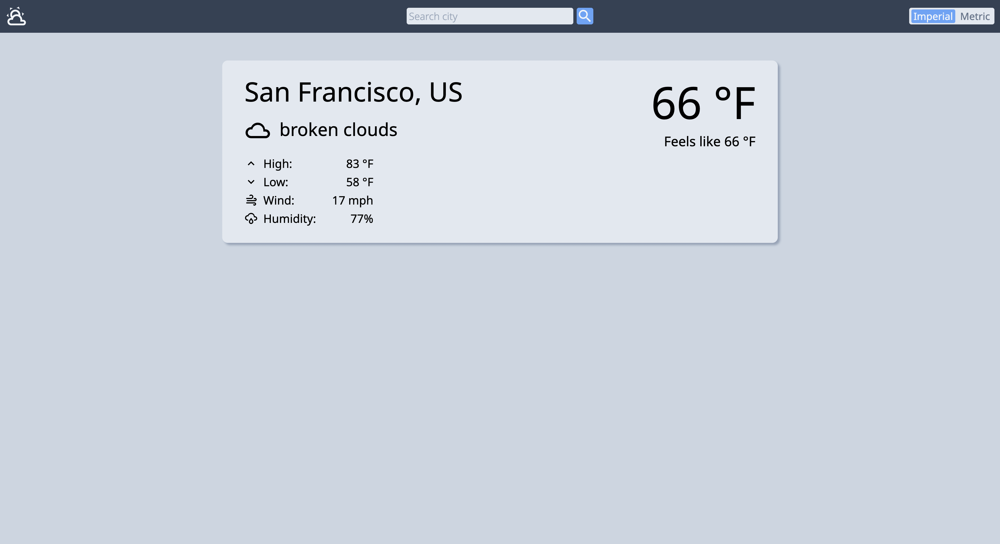

# Weather App

## Description

Simple website to check weather using the [OpenWeather](https://openweathermap.org) API.

**Languages:** HTML, CSS, JavaScript  
**Other tools/technologies:** Webpack, ESLint, Prettier, PubSubJS

## Live Preview

Check it out [here](https://wzhengg.github.io/weather-app/)  

## Motivation

The focuses of this project were to learn and practice asynchronous JavaScript with promises and `async/await` and learn to use APIs.

## Future tasks
* Fix dialog issue on Safari
* Show background image for weather condition
* Make it responsive
